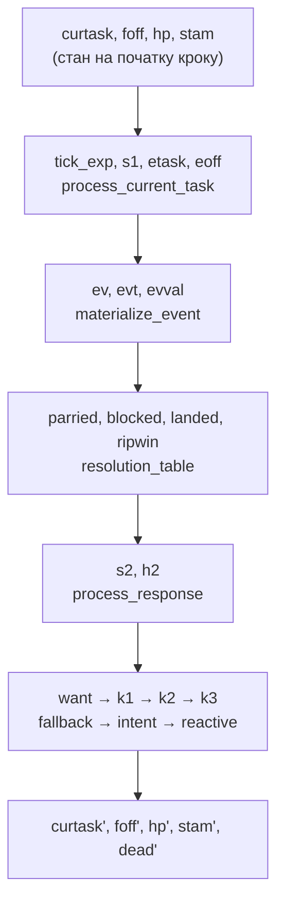

# Формалізація дуельного середовища мовою RDDL

> **Статус:** модель побудована, **перевірена** і **придатна для навчання**.
>
> - Відтворює всі три parity-фікстури (`parity/trajectories/*.json`) покадрово —
>   24 кадри × 2 бійці, **0 розбіжностей**.
> - Наскрізна еквівалентність із `fight_env` під тим самим ботом `Aggressive`:
>   1679 кроків, 20 посівів, **0 розбіжностей** у динаміці.
> - PPO навчається поверх неї без змін у пайплайні.
>
> Файли: `rddl/duel_domain.rddl`, `rddl/duel_instance.rddl`, `rddl/train_env.py`,
> `rddl/check_parity.py`, `rddl/check_equivalence.py`.

Цей документ відповідає на питання «чи можна правила `fight_env` — усі дії,
кадри та події — описати стандартною мовою?». Коротка відповідь: **так, RDDL
підходить**, і нижче показано як саме. Оскільки з RDDL ми раніше не працювали,
розділ 1 — це повноцінний вступ у мову; далі йде відображення на наш код,
реальні обмеження, альтернативні стандарти та знахідки, які спливли по дорозі.

---

## Зміст

1. [Що таке RDDL](#1-що-таке-rddl)
2. [Три прийоми, на яких тримається модель](#2-три-прийоми-на-яких-тримається-модель)
3. [Покрокова відповідність `flow()`](#3-покрокова-відповідність-flow)
4. [Обмеження, на які ми справді наткнулися](#4-обмеження-на-які-ми-справді-наткнулися)
5. [Що це дає роботі і скільки коштує](#5-що-це-дає-роботі-і-скільки-коштує)
6. [Альтернативні стандарти](#6-альтернативні-стандарти)
7. [Знахідки в коді, які виявила формалізація](#7-знахідки-в-коді-які-виявила-формалізація)
8. [Навчання поверх RDDL-середовища](#8-навчання-поверх-rddl-середовища)
9. [Як запустити](#9-як-запустити)

---

## 1. Що таке RDDL

**RDDL** (*Relational Dynamic Influence Diagram Language*) — мова декларативного
опису марковських процесів прийняття рішень. Її створив Скотт Саннер у 2010 році
як мову міжнародних змагань з імовірнісного планування (IPPC), і сьогодні вона
має живу референсну реалізацію — **pyRDDLGym**, яка перетворює текст моделі на
готове `gymnasium`-середовище.

Головна ідея: замість того, щоб *програмувати* середовище, ви **описуєте
факторизований MDP** — набір змінних стану й рівняння, що задають, як кожна
змінна змінюється за один крок часу.

### 1.1 Найважливіше: це не програма, а система рівнянь

Це та відмінність, об яку найлегше спіткнутися. У RDDL **немає** циклів, немає
локальних змінних, немає послідовних присвоєнь, немає функцій. За один крок часу
кожна змінна отримує значення **рівно один раз**.

```python
# Python: послідовна мутація — так НЕ можна в RDDL
model.stamina -= cost
model.stamina = min(model.stamina, max_stamina)
```

```rddl
// RDDL: одне рівняння, один результат
s1(?s) = min[MAXSTAM, stam(?s) - cost(?s)];
```

Якщо в Python значення змінюється тричі поспіль, у RDDL це стає **трьома різними
змінними** — `s1`, `s2`, `s3`. Саме це нам довелося зробити з `try_transition`
(розділ 2.3).

### 1.2 Три блоки

Модель складається з трьох блоків. pyRDDLGym читає їх із двох файлів: `domain`
окремо, а `non-fluents` + `instance` — разом.

| Блок | Що містить | Наш файл |
|---|---|---|
| `domain` | Типи, змінні, рівняння переходів, винагорода, умови завершення. **Правила гри.** | `rddl/duel_domain.rddl` |
| `non-fluents` | Конкретні значення констант: таблиці, зброя, топологія. | `rddl/duel_instance.rddl` |
| `instance` | Початковий стан, горизонт, коефіцієнт дисконтування. | `rddl/duel_instance.rddl` |

Розділення `domain` / `instance` — це саме те, що потрібно для експериментів:
правила бою лишаються незмінними, а спорядження, початкове HP чи тип суперника
змінюються в інстансі.

### 1.3 П'ять видів змінних (fluents)

Усі змінні оголошуються в блоці `pvariables` у форматі
`ім'я(типи_параметрів) : { вид, тип_значення, default = ... };`

| Вид | Значення | Аналог у `fight_env` |
|---|---|---|
| `non-fluent` | Константа, не змінюється протягом симуляції | `tasks_data`, `weapons`, `shields` |
| `state-fluent` | Стан. Для кожного **обов'язково** має бути рівняння | `PlayerModel.hp`, `.stamina`, `.task` |
| `action-fluent` | Дія агента. Поза кроком має значення `default` | `ActionType` |
| `interm-fluent` | Проміжне обчислення всередині одного кроку | стадії `flow()` |
| `observ-fluent` | Те, що бачить агент (для POMDP) | 7-компонентний вектор `_get_obs` |

`interm-fluent` — ключ до всього. Це те, що дозволяє описати **конвеєр**
всередині одного логічного кадру. Проміжні змінні можуть залежати одна від
одної, і pyRDDLGym сам вибудовує порядок обчислення (топологічне сортування);
явно вказувати рівні стратифікації, як вимагала стара специфікація, більше не
потрібно.

### 1.4 Типи значень

`bool`, `int`, `real`, **enum** (перелічення, оголошене в `types`) і **object**
(тип об'єкта, значення якого задаються в інстансі). Останні два роблять RDDL
придатною для нашої FSM — стан бійця це не число, а іменований таск.

```rddl
types {
    side  : {@a, @b};                                   // enum
    task  : {@none, @stance, @attack1, @parry, ...};    // enum
    fidx  : {@f0, @f1, @f2, @f3, @f4, @f5};             // enum
    event : {@e_none, @e_attack, @e_parry, ...};        // enum
};
```

Символ `@` позначає літерал перелічення.

### 1.5 Рівняння переходів (CPFs)

Блок `cpfs` містить по одному рівнянню на кожен `state-fluent` і кожен
`interm-fluent`. Штрих `'` означає «на наступному кроці»:

```rddl
hp'(?s) = h2(?s);
```

Правий бік читає стан **на початку кроку** (без штриха), дії та проміжні змінні.
Це напрочуд зручно: те, що в Python довелося робити руками через
`make_snapshot()`, у RDDL виходить безкоштовно — рівняння **за визначенням**
бачить стан до переходу.

Знак `?s` — вільна змінна, що пробігає всі об'єкти свого типу. Один рядок
описує обох бійців одразу: це і є «relational» у назві мови.

### 1.6 Вирази

- **Умови:** `if (умова) then A else B` та `switch (enum_вираз) { case @x : A, default : B }`
- **Логіка:** `^` (І), `|` (АБО), `~` (НЕ), `=>`, `<=>`
- **Порівняння:** `==`, `~=` (не дорівнює), `<`, `<=`, `>`, `>=`
- **Арифметика:** `+ - * /`, `div[x,y]`, `mod[x,y]`, `min[x,y]`, `max[x,y]`, `abs[x]`, `pow[b,x]`
- **Агрегації:** `sum_{?x : тип}[...]`, `prod_`, `avg_`, `min_`, `max_`, `argmax_`, `argmin_`
- **Квантори:** `forall_{?x : тип}[...]`, `exists_{?x : тип}[...]`

> **Пастка** (документована в `rddl-eval`): агрегація «поглинає» все, що йде за
> нею. `sum_{?s : shelf}[1] - 10` при трьох об'єктах дорівнює −27, а не −7.
> Тому агрегації **обов'язково** беруть у дужки.

### 1.7 Імовірність

Правий бік рівняння може бути розподілом — і саме тут RDDL сильніша за наш
Python-код:

`KronDelta(v)` (детермінований), `Bernoulli(p)`, `Discrete(тип, ймовірності)`,
`Poisson`, `Binomial`, `Normal`, `Dirichlet` тощо.

Наш бойовий кор детермінований, тож розподіли не потрібні. Але боти викликають
`random.random()`, і саме через це їх довелося винести за межі parity-контракту.
У RDDL випадковість бота стає **декларованою частиною моделі** —
`Discrete(...)` замість прихованого RNG.

### 1.8 Обмеження та завершення

```rddl
action-preconditions { ... };   // що агент може робити (перевіряється щокроку)
state-invariants     { ... };   // властивості, які мають виконуватись завжди
termination          { ... };   // епізод завершено, якщо хоч одна умова істинна
```

`action-preconditions` дає нам `Discrete(4)` безкоштовно: «не більше однієї дії
за крок». `state-invariants` — це фактично вбудовані assert'и: симулятор
зупиниться, якщо HP стане від'ємним.

### 1.9 Мінімальний приклад

У нас уже є один — `rddl-eval/envs/frozenlake3x3.rddl`. Ось його суть:

```rddl
domain frozenlake {
    types { cell : object; };

    pvariables {
        NORTH(cell, cell) : { non-fluent, bool, default = false };  // топологія
        HOLE(cell)        : { non-fluent, bool, default = false };
        at(cell)          : { state-fluent, bool, default = false }; // де ми
        move_north        : { action-fluent, bool, default = false };
    };

    cpfs {
        at'(?c) = if ( exists_{?f : cell} [ at(?f) ^ (HOLE(?f) | GOAL(?f)) ] )
                  then at(?c)                                   // застрягли
                  else ( move_north ^ exists_{?f : cell} [ at(?f) ^ NORTH(?f, ?c) ] ) | ... ;
    };

    reward = if ( exists_{?c : cell} [ at'(?c) ^ GOAL(?c) ] ) then 1.0 else 0.0;
    termination { exists_{?c : cell} [ at(?c) ^ (HOLE(?c) | GOAL(?c)) ]; };
}
```

Зверніть увагу: **сітки як такої немає**. Є тип `cell` і відношення `NORTH`,
задані в `non-fluents`. Домен описує *правила руху*, інстанс — *конкретну карту*.
Рівно так само наш домен описує правила бою, а інстанс — спорядження.

---

## 2. Три прийоми, на яких тримається модель

Наївно здається, що RDDL не впорається: у нас таблиці, індексовані станом,
покадрова шкала часу й послідовні мутації. Кожна з цих проблем має розв'язок.

### 2.1 Вкладені pvariables — таблиці індексуються станом

Це найважливіше відкриття. У специфікації є розділ **Nested pVariables**:
параметром змінної може бути **інша змінна**. Тому `tasks_data` індексується
поточним таском напряму:

```rddl
tick_exp(?s) = FNUM(foff(?s)) >= TASK_DUR(curtask(?s));
ev(?s)       = TASK_EVENT(etask(?s), eoff(?s));   // подвійне вкладення
```

`TASK_DUR(curtask(?s))` — це буквально `tasks_data[model.task].duration`.
Без цієї можливості довелося б кодувати таск булевою матрицею-індикатором
(`in_task(?s, ?t)`) і робити пошук через `sum_{?t : task}[...]` — модель була б
удвічі довшою й нечитабельною. Так само `OTHER(?s)` — константа типу `side`,
тому `ev(OTHER(?s))` дає подію суперника без жодних агрегацій.

### 2.2 Кадр як об'єкт перелічення

Щоб `TASK_EVENT(task, fidx)` працювала, зсув кадру мусить бути **об'єктом**, а не
числом. Тому `fidx : {@f0..@f5}`, а зворотне перетворення дає константа
`FNUM(fidx) : int`. Оскільки найдовший таск — 5 кадрів, це дешево.

```rddl
FNUM(@f0)=0; FNUM(@f1)=1; ... FNUM(@f5)=5;
FSUCC(@f0)=@f1; FSUCC(@f1)=@f2; ... FSUCC(@f5)=@f5;   // насичення
```

`TaskTimeline.frame_offset` перетворюється на:

```rddl
poff(?s) = if (tick_exp(?s)) then @f0
           else if (TASK_LOOP(curtask(?s))) then @f0   // єдиний циклічний таск має duration 1
           else FSUCC(foff(?s));
```

### 2.3 Розгортання послідовних `try_transition`

Найбільш «шумна» частина. У Python `flow()` тричі поспіль викликає
`try_transition`, і кожен виклик **мутує** модель — `set_task` скидає таймлайн,
що змінює `expired` для наступного виклику:

```python
f1_fallback_resolved = self.fighter1.fallback()        # -> FIGHTING_STANCE
f1_intent_resolved   = self.fighter1.process_intent()  # -> намір агента
f1_reactive_resolved = self.fighter1.reactive(snapshot1)
```

У RDDL це стає ланцюгом трійок `(таск, expired, frame_number==0)`:

```rddl
ch1(?s) = ...;  k1(?s) = if (ch1(?s)) then @stance else ptask(?s);  e1(?s) = ...;
ch2(?s) = ...;  k2(?s) = if (ch2(?s)) then want(?s) else k1(?s);    e2(?s) = ...;
ch3(?s) = ...;  k3(?s) = if (ch3(?s)) then rcand(?s) else k2(?s);
curtask'(?s) = k3(?s);
```

Сама арбітражна логіка `try_transition` перекладається дослівно:

```python
prioritised = incoming.priority > current.priority
if not prioritised and current.priority == incoming.priority:
    if frame_number == 0:
        prioritised = incoming.start_priority > current.start_priority
    if not prioritised and current.interruptible:
        prioritised = True
```

```rddl
(TASK_PRIO(want(?s)) > TASK_PRIO(k1(?s)))
| ( (TASK_PRIO(want(?s)) == TASK_PRIO(k1(?s)))
    ^ ( ( ch1(?s) ^ (TASK_SPRIO(want(?s)) > TASK_SPRIO(k1(?s))) )
        | TASK_INTERRUPT(k1(?s)) ) )
```

Умова `frame_number == 0` перетворюється на `ch1(?s)` — «таск щойно було
встановлено на попередній стадії цього ж кадру». Після `tick()` лічильник кадрів
ніколи не дорівнює нулю, тож `frame_number == 0` істинне рівно тоді, коли
попередня стадія зробила `set_task`.

---

## 3. Покрокова відповідність `flow()`



| `fight_env` | RDDL у `duel_domain.rddl` |
|---|---|
| `Orchestrator.flow()` — один кадр | один крок RDDL |
| `make_snapshot()` | не потрібен: праворуч від `=` стоїть стан до переходу |
| `process_current_task` | `tick_exp`, `s1` |
| `materialize_event` | `etask`, `eoff`, `ev`, `evt`, `evval` |
| `timeline.tick()` | `ptask`, `poff`, `pexp` |
| `resolution_table` | `parried`, `blocked`, `broke`, `landed`, `ripwin` |
| `_resolve_duelists` двічі (симетрія) | автоматично: рівняння ліфтоване по `?s` |
| `process_response` | `s2`, `h2`, `dead'` |
| `intent_processing` + промоція в RIPOSTE | `want` |
| `reactive_processing.process_changes` | `rcand` |
| `try_transition` × 3 | `ch1/k1/e1 → ch2/k2/e2 → ch3/k3` |
| `tasks_data` | блок `non-fluents` — таблиця в таблицю |
| винагорода `gym_env.step` | блок `reward` |
| `Discrete(4)` | `action-preconditions` |
| `terminated` | блок `termination` |

Промоція в ріпост — та сама «прихована» механіка, заради якої існує дослідження —
в RDDL займає один рядок і стає явною:

```rddl
want(?s) = if (act_attack(?s)) then (if (ripwin(?s)) then @riposte else @attack1)
           else if (act_block(?s)) then @defense
           else if (act_parry(?s)) then @parry
           else @none;
```

---

## 4. Обмеження, на які ми справді наткнулися

Це не теоретичні застереження — усе нижче спливло під час збирання моделі.

**1. Параметром вкладеної pvariable може бути лише змінна або літерал, не вираз.**
Компілятор відхилив:

```rddl
ev(?s) = TASK_EVENT(etask(?s), if (tick_exp(?s)) then @f0 else foff(?s));
//                             ^ RDDLParseError: Incorrect use of reserved keyword: if
```

Лікується виносом виразу в окремий `interm-fluent`:

```rddl
eoff(?s) = if (tick_exp(?s)) then @f0 else foff(?s);
ev(?s)   = TASK_EVENT(etask(?s), eoff(?s));
```

**2. RDDL одноагентна.** Дуель — це гра з *одночасними* ходами двох гравців, а
RDDL описує MDP одного агента. Суперника доводиться «вшивати» в модель. Це не
регрес — у `gym_env.py` бот уже є частиною середовища; але формально це означає,
що модель описує *агента проти фіксованої політики*, а не гру. У нашій моделі
обидві сторони мають `action-fluent` (щоб можна було програвати фікстури); для
навчання `@b` замінюється на політику в рівняннях.

**3. Enum не бере участі в арифметиці.** Звідси допоміжна `FNUM(fidx)`.

**4. Спрощення `frame_number` vs `frame_offset`.** Python перевіряє
`timeline.frame_number == 0` (абсолютний лічильник), ми ж використовуємо зсув.
Вони розходяться лише для циклічних тасків, а єдиний циклічний таск —
`FIGHTING_STANCE` з нульовою вартістю входу, тож різниці немає. Якщо з'явиться
циклічний таск із `base_stamina_cost != 0`, це місце треба переписати.

**5. TTL намірів не моделюється.** `Intent.ttl = 1` означає, що намір живе рівно
один кадр, тож він еквівалентний дії поточного кроку. Якщо TTL стане більшим за 1,
знадобиться додатковий стан.

---

## 5. Що це дає роботі і скільки коштує

### Дає

- **Формальна специфікація за стандартом.** У дипломі середовище описане мовою
  міжнародних змагань з планування, а не лише кодом. Це прямо посилює розділ про
  методологію: MDP не «мається на увазі», а виписаний.
- **Перевіряється наявним оракулом.** Фікстури `parity/trajectories/*.json` уже
  існують і вже використовуються для C#-порту. RDDL-модель проходить той самий
  контракт (`rddl/check_parity.py`), тому це не декларація, а верифікований
  артефакт.
- **Фактори експерименту стають параметрами інстансу.** Спорядження, початкове
  HP, тип суперника — усе те, що дослідження варіює, — переїжджає з коду в
  `non-fluents`. Замість гілок у Python маємо набір інстанс-файлів.
- **Baseline для PPO.** pyRDDLGym дає символьний і JAX-планувальник, тобто
  можливість порахувати *оптимальну* політику й чесно порівняти з вивченою.
  Це набагато сильніший результат, ніж графік навчання без точки відліку.
- **Явна часткова спостережуваність.** Через `observ-fluent` можна формально
  зафіксувати, що агент **не бачить** stamina суперника — тобто задача насправді
  POMDP, а не MDP. Наразі це ніде не задокументовано.

### Коштує

Це **четверте** місце, яке треба тримати синхронним: Python → C# → ONNX → RDDL.
`CLAUDE.md` уже фіксує, що енкодер спостережень продубльовано в чотирьох місцях і
що вони «тихо розходяться». Тому рекомендація: **не робити RDDL виконуваним
рантаймом**. Її роль — специфікація й оракул, який ганяється по тих самих
фікстурах. Будь-яка зміна `tasks_data` або `resolution_table` вимагає
`python -m parity.dump_trajectory` → Unity EditMode тести → `python rddl/check_parity.py`.

---

## 6. Альтернативні стандарти

| Стандарт | Придатність | Оцінка |
|---|---|---|
| **RDDL** | **обрано** | Єдина мова, що покриває *і* FSM, *і* винагороду, *і* RL-інтеграцію одночасно. Перевірено на нашому коді. |
| **PRISM / Storm** (MDP) | дуже добра | Guarded commands + **синхронізаційні мітки**: обмін «подія ↔ реакція» — це буквально синхронізована дія двох модулів. Дає **model checking**: «чи існує стратегія, що досягає ріпосту з імовірністю ≥ p», і точну оптимальну політику. Ціна — простір станів: 9 тасків × 6 кадрів × 17 HP × 22 stamina ≈ 2·10⁴ на бійця, у квадраті ≈ **4·10⁸**. Досяжна множина значно менша; при HP=8 стає комфортно. |
| **JANI** | добра як ціль генерації | JSON-формат для Storm/Modest. Головна перевага: його можна **згенерувати скриптом прямо з `tasks_data`**, і проблема розсинхрону зникає в принципі. |
| **UPPAAL / Stratego** | добра для таймінгів | Таск = локація, подія на кадрі k = guarded transition. Stratego вміє синтез контролера + RL. Мінус: семантика неперервного часу, а наші тики дискретні. |
| **PDDL 2.1 / PDDL+ / PPDDL** | посередня | `durative-action` гарно лягає на «дія триває N кадрів», але PDDL цілеорієнтована й слабка на винагородах — для RL не те. |
| **SCXML / UML statecharts** | лише структура | W3C-стандарт, ідеально опише `tasks_data` з пріоритетами та `interruptible`, але **не має ні винагороди, ні ймовірностей**. Годиться як шар документації FSM. |
| **OpenSpiel** | якщо цікавить *гра* | Єдиний варіант, що чесно моделює **одночасні ходи двох гравців**. Якщо тема зміститься до self-play чи рівноваги — це туди. |

**Рекомендація:** RDDL як основна формалізація; JANI/PRISM — якщо знадобляться
формальні гарантії або точний оптимум для порівняння з PPO.

---

## 7. Знахідки в коді, які виявила формалізація

Щоб перекласти правила, їх довелося прочитати дослівно. Це виявило кілька
розбіжностей між тим, що код *робить*, і тим, що він, вочевидь, *мав* робити.

### 7.1 Винагорода за парирування ніколи не нараховується

**Це найважливіше — воно б'є прямо в тему дослідження.**

```python
# fight_env/gym_env.py
if f1_res.type == Responses.HAS_PARRIED:
    reward += 0.5
```

`f1_res` — це перший елемент `_resolve_duelists(event_агента, event_суперника)`,
тобто реакція на **власну** подію агента. Коли агент парирує, спрацьовує правило
`(ATTACK, PARRY)`, де `HAS_PARRIED` є **другим** елементом — і потрапляє в
`f1_res2`, а не в `f1_res`.

Перевірено емпірично (агент парирує атаку суперника):

```
step 3: agent_responses=[('NONE', 0), ('HAS_PARRIED', 2)]
        f1_res.type == HAS_PARRIED ?  False   -> внесок у винагороду 0.0
```

Отже, **агент не отримує жодного сигналу за вдале парирування**. Оскільки вся
робота присвячена тому, чи здатен агент відкрити ланцюг `parry → riposte`, це
означає, що ключова проміжна ланка ланцюга не підкріплюється, і відкрити її можна
лише через відкладену винагороду за ріпост. Виправлення — одне слово:

```python
if f1_res2.type == Responses.HAS_PARRIED:   # було f1_res
    reward += 0.5
```

⚠️ Це змінює винагороду, тобто **інвалідує навчену політику `fight_ppo.zip`** і
потребує перенавчання. На поведінку бойового кору не впливає — parity-фікстури
лишаються чинними.

У RDDL-моделі блок `reward` навмисно відтворює **фактичну** поведінку Python
(без члена за парирування), щоб модель лишалась дзеркалом коду, а не його
виправленою версією.

### 7.2 Пробиття блоку не має жодного ефекту

Правило `(ATTACK, BLOCK)` при `a.value > b.value` видає
`HAS_DEFENSE_BROKEN` / `HAS_BEEN_DEFENSE_BROKEN`. Але `response_processing`
обробляє лише `HAS_BLOCKED`, `HAS_BEEN_BLOCKED`, `HAS_BEEN_PARRIED` (stamina) і
`HAS_BEEN_ATTACKED` (HP). Тобто **пробиття блоку не завдає ні шкоди, ні втрати
витривалості** — воно повністю беззубе.

З поточним спорядженням (gladius 2 dmg проти buckler 1 def) ця гілка спрацьовує
щоразу, коли атака зустрічає блок — тобто блок наразі є *ідеальним* захистом без
жодних наслідків для атакувального. У моделі змінна `broke(?s)` обчислюється, але
навмисно ні на що не впливає — щоб розрив був видимим, а не забутим.

### 7.3 Витривалість стартує вище власного максимуму

`DEFAULT_STAMINA = 20`, але `max_stamina = 20 − вага(3) = 17`. Гравець
починає з 20 і «зрізається» до 17 на першому ж тіку `process_current_task`.
Видно у фікстурах: кадр 0 → 20, кадр 1 → 17. Поведінка нешкідлива, але це означає,
що перший кадр епізоду має інші числа, ніж усі наступні. У моделі відтворено
дослівно (`stam` default = 20).

### 7.4 Дрібниці

- `fight_env/player/player_model.py:15` — `current_event: Event = field(default_factory=list)`
  створює `list`, а не `Event`. Наразі нешкідливо (`tick()` перезаписує до першого
  читання), але тип бреше.
- `fight_env/player/stats.py:86-88` — властивість `base_stamina_expense` не має
  декоратора `@lazy_recalc`, тож звернення до неї першою дасть `AttributeError`.
  Не стріляє лише тому, що `calc_stamina_cost_enter_task` / `calc_stamina_cost_frame`
  не підключені — той самий свідомий розрив, що описаний у `CLAUDE.md`.

---

## 8. Навчання поверх RDDL-середовища

`rddl/train_env.py` дає `RDDLFightEnv` — drop-in заміну `fight_env.gym_env.FightEnv`:
той самий `Discrete(4)`, той самий 7-float вектор спостережень, той самий суперник.

```python
from stable_baselines3 import PPO
from rddl.train_env import RDDLFightEnv

model = PPO("MlpPolicy", RDDLFightEnv(max_steps=500), verbose=1)
model.learn(total_timesteps=500_000)
```

### Суперник лишається в Python — і це навмисно

Бота **не** перенесено в правила. Причина та сама, з якої `CLAUDE.md` тримає ботів
поза бойовим кором і поза фікстурами: вони викликають `random.random()`, і їхня
тактика — це політика, а не правило дуелі. Обидві сторони беруть дії ззовні, як і
в `check_parity.py`.

Головне: `Aggressive` **перевикористано без жодної зміни**. Клас звертається рівно
до двох методів об'єктів, якими його сконструйовано, тому досить двох підставних
об'єктів — жодного monkeypatching, `Player` не задіяний:

```python
class Observed:                       # на місце `opponent`
    def make_snapshot(self): return self.snapshot
class Acting:                         # на місце `player`
    def request_intent(self, action, ttl=1): self.action = action

bot = Aggressive(acting, observed)    # справжній клас з fight_env/bots/
```

Тайминг сходиться сам: `next_move()` читає знімок суперника **до** тіку, а стан
після `env.step()` — це і є стан на початку наступного кроку. Завдяки цьому
`defensive.py` і `random.py` під'єднаються без жодного рядка коду.

### Чим це перевірено

`rddl/check_equivalence.py` ганяє обидва середовища під однаковим посівом
глобального `random` і однаковою послідовністю дій агента. Оскільки бот —
єдине джерело випадковості, траєкторії мусять збігтися **побітово**:

```
seeds: 20   steps compared: 1679
observation/termination mismatches: 0
```

Це сильніша перевірка за фікстури: вона проходить сотні кроків через стани, яких
три рукописні сценарії ніколи не досягають.

> **Підводний камінь.** Обидва середовища тягнуть з одного глобального
> `random`, тож епізоди треба ганяти **послідовно**, а не чергуючи кроки —
> інакше кожне забирає кожне друге число і порівняння втрачає сенс.

### Продуктивність

| | кроків/с | 500k кроків |
|---|---|---|
| `fight_env` | ~85 700 | ~6 с |
| `RDDLFightEnv` | ~1 940 | ~257 с |

RDDL у ~44 рази повільніша — вона інтерпретує дерево виразів замість того, щоб
виконувати Python-код. На практиці це неважливо: у прогоні PPO на 20k кроків
(23 с) на середовище припало ~10 с, решта — сам оптимізатор. Повне навчання на
500k кроків — близько десяти хвилин.

### Перевірка навчанням

```
gymnasium check_env: PASS
trained 20k steps in 23.3s
random policy : -6.70 +/- 2.59
PPO 20k       : -4.87 +/- 4.67
```

PPO стабільно перевершує випадкову політику вже на 20k кроків. Від'ємні числа —
не помилка: за поточної схеми винагороди агент штрафується за отримані удари
(див. нижче), а суперник агресивний.

### Схема винагороди тепер параметр інстансу

Усі коефіцієнти винесено в `non-fluents`, тож reward shaping — один із факторів
вашого дослідження — змінюється без правки домену:

```rddl
R_HIT = 0.3;  R_CRIT = 1.0;  R_TAKE_HIT = -0.3;  R_TAKE_CRIT = -1.0;
R_WIN = 5.0;  R_LOSE = -5.0;  R_PARRY = 0.0;
```

⚠️ **Важливо перед навчанням.** `R_PARRY = 0.0` — це не рекомендація, а дзеркало
поточної поведінки `gym_env.step` (розділ 7.1). Крім того, у поточній версії
`gym_env.py` перевірка отриманого удару теж читає `f1_res` замість `f1_res2`,
тож **штраф за отриману шкоду теж не нараховується**. Наслідок вимірюваний:

| середня віддача за епізод (випадковий агент, 30 посівів) | |
|---|---|
| `fight_env` у поточному вигляді | −3.87 |
| RDDL зі штрафом за шкоду | −6.85 |

Різниця — це рівно ті 130 кадрів, у яких агент втратив HP і не отримав за це
нічого. Тобто зараз агент не має жодного стимулу захищатися. Для змістовного
навчання варто або полагодити `gym_env.py`, або навчати на RDDL-середовищі, де
коефіцієнти діють.

---

## 9. Як запустити

pyRDDLGym не входить у проєктний `.venv` — це окрема залежність:

```bash
pip install pyRDDLGym
python -m rddl.check_parity        # проти трьох фікстур
python -m rddl.check_equivalence   # проти fight_env наскрізно, під ботом
```

Очікуваний вивід:

```
[attack_vs_idle] MATCH  (8 frames x 2 fighters)
[attack_vs_block] MATCH  (6 frames x 2 fighters)
[parry_then_riposte] MATCH  (10 frames x 2 fighters)

total mismatches: 0
```

Модель уже є повноцінним `gymnasium`-середовищем:

```python
import pyRDDLGym
env = pyRDDLGym.make("rddl/duel_domain.rddl", "rddl/duel_instance.rddl", vectorized=False)
state, _ = env.reset()
state, reward, terminated, truncated, _ = env.step({"act_attack___a": True})
```

### Що лишилось незробленим

- `observ-fluent` для 7-компонентного вектора спостережень — модель наразі
  повністю спостережувана, а вектор збирається обгорткою в `train_env.py`.
- Порівняння PPO з оптимальною політикою від планувальника. Це єдине, чому
  завадив винос бота в Python: планувальники pyRDDLGym **розв'язують** модель,
  читаючи рівняння, тож суперник має бути всередині неї. Робиться окремим
  файлом `duel_planning_domain.rddl` зі вшитим `Bernoulli`-ботом, який не чіпає
  ані parity-модель, ані навчання.

---

## Джерела

- Специфікація RDDL: <https://github.com/pyrddlgym-project/pyRDDLGym/blob/main/docs/rddl.rst>
  (локальна копія — `rddl-eval/spec/rddl.rst`)
- pyRDDLGym: <https://github.com/pyrddlgym-project/pyRDDLGym>
- Приклад для порівняння: `rddl-eval/envs/frozenlake3x3.rddl`
